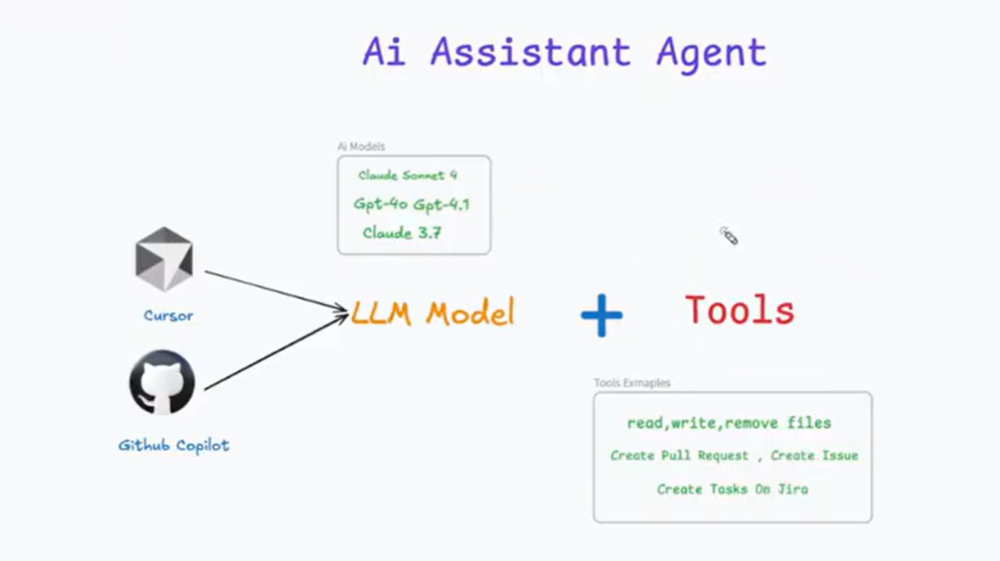
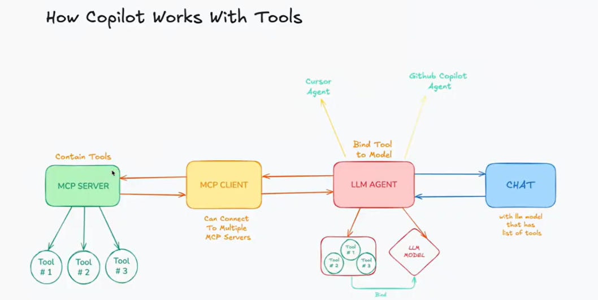
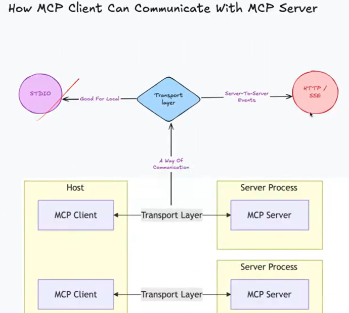
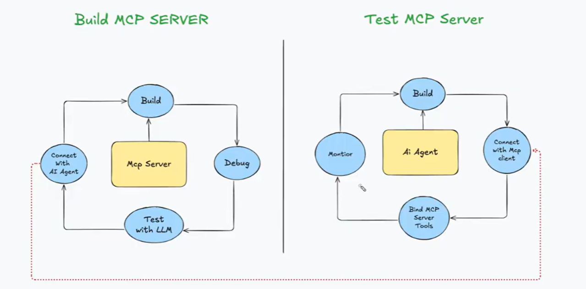
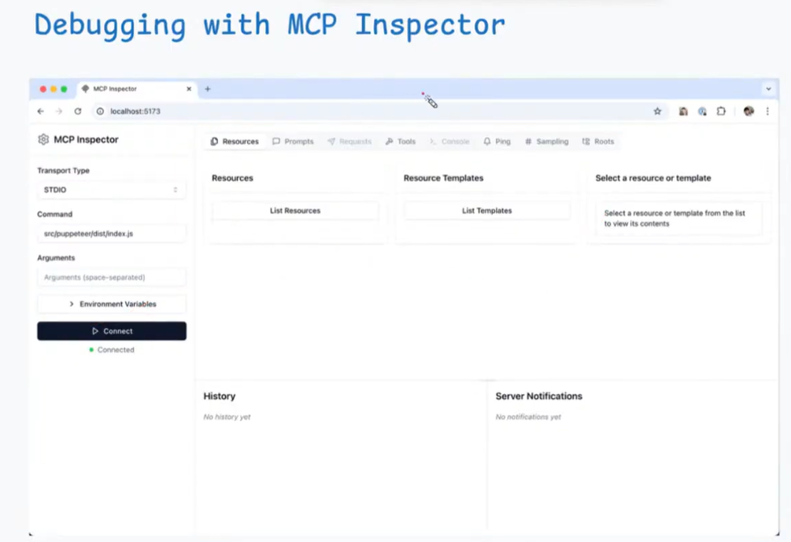

# 🔌 MCP: The Backend Engineer's Guide

A concise, point-by-point reference for understanding the Model Context Protocol (MCP) from a system architecture and development perspective.

### 🧮 Simple Example: Calculator Tool

**1. AI Model (Standalone LLM)**
*   **Behavior:** Relies on internal training patterns.
*   **Process:** When asked "What is 123 * 456?", it tries to predict the next token based on its training (like memorizing $2 + 3 = 5$).
*   **Risk:** Can "hallucinate" or provide incorrect results for complex or very large numbers.

**2. AI Agent with MCP (AI Model + Calculator Tool)**
*   **Behavior:** Delegates the calculation to a reliable external program.
*   **Process:** The model recognizes a mathematical request and triggers a **Calculator Tool** (MCP Tool) to compute the exact sum/product.
*   **Benefit:** Guaranteed precision by using a deterministic tool instead of probabilistic prediction.

---

### 🛒 Real-World Example: E-commerce Assistant (Scenario: Platzi Fake Store API)

**1. AI Model (Standalone LLM)**
*   **Status:** A "Static Knowledge Base" that suggests products based on training data.
*   **Interaction:** User asks "What's a good laptop under $500?" and the model suggests one based on general knowledge.
*   **Limitations:** No access to **Platzi API** for real-time stock, cannot check current prices, and can't remember past user orders.
*   **Analogy:** A knowledgeable salesperson who has no connection to the store's inventory system or cash register.

**2. AI Agent with MCP (AI Model + Context + Platzi API)**
* 
*   **Status:** An "Action-Oriented Agent" with programmatic environment access.
*   **Interaction:** User asks same question; the Agent calls **Platzi API endpoints** to fetch live product lists, checks stock, and suggests options.
*   **Capabilities:** Once the user confirms, it executes the order via API, remembers preference (e.g., "likes SSDs"), and tracks shipments automatically.
*   **Analogy:** A digital personal shopper who can access the warehouse, apply your loyalty points, and complete the purchase for you.

---

### What is MCP?

MCP, developed by Anthropic, is an **open standard protocol** that connects AI models to external data and tools.

*   **Universal Bridge**: One protocol to link any AI model with any data source.
*   **Interoperable**: Build a tool once; use it across Claude, IDEs, and custom apps.
*   **Client-Server**: Standardizes communication between the AI (Client) and the data (Server).
*   **Live Context**: Gives models real-time access to files, databases, and APIs.

### MCP Components

* 
* **Host**: The application (e.g., Claude Desktop, IDE) where you interact with the AI.
* **Client**:
    - lives inside MCP host
    - can connect to more than one MCP server
    - without MCP client, LLM can't connect to MCP Server
* **Server**: exposes tools like API, DB, files, etc... to the LLM.

### How MCP Works
<!-- * 
1. You ask a question to the MCP host.
2. MCP host asks MCP server for the available tools
3. MCP server returns the available tools to MCP host.
4. MCP host sends the available tools + your question to the LLM
5. LLM decides to use a tool and sends the required tool to MCP host
6. MCP host calls the the MCP server for the tool result
7. MCP server will use the availabe resources with him like DB, API, files and etc...
8. MCP server returns the tool result back to the MCP host.
9. MCP host sends the tool result to the LLM
10. LLM uses the tool result to answer your question
11. MCP host sends the answer to you -->
* 
1. Your question moves from chat app to LLM Agent
2. LLM Agent goes to the LLM model with the question and see if there is tools available with the LLM Agent for this question
- if no tools available with LLM:
3. LLM Agent goes to MCP Client
4. MCP client asks the MCP server for the available list of tools
5. tools return from MCP server to MCP client and then to LLM Agent which will memorize them
- if tools available with LLM Agent:
3. LLM model will ask to execute a specific tool it has depending on the quesiton, request will move to MCP client and then to MCP Server which will execute it and then go back to MCP client and then to LLM Agent and so on so forth...

### MCP client and server communication ways

* 
- There is also a third type called Streamable HTTP (used for remote MCP like HTTP/SSE) and it is preferred in case you want to send large data (files, videos, images, large json, etc...)

### Why I need MCP instead of API calls?

- without MCP:
* 
- each service has its own API and you need to create a custom integration for each service

- with MCP:
* 
- each service has its own MCP server and you can use the same MCP host to connect to all of them

### How to connect MCP server to MCP host (Claude, VS Code, etc...)?

* 
- through the configuration file for each each MCP host

### Agent should focus on a specific domain to avoid hallucination

* 
* 

### MCP usecases

* 
* 
  - in case of developing an API and I need to make my AI agent to have an access to my database (mongoDb, mysql, etc...) and make some actions like create, update, delete, etc... 
* you can connect your MCP host with GitHub MCP server and give it permission to create PR, commits and so on...

### Whole cycle to build MCP

* 

### MCP Debugging
* 
* use MCP Inspector, a tool developed by MCP team
* run this command after running the MCP server:
    - npx @modelcontextprotocol/inspector dotnet run
* u can debug local and remote MCP servers

### Resources
* https://www.youtube.com/watch?v=exUBtn1cTZk
* https://www.youtube.com/watch?v=E2DEHOEbzks
* https://www.youtube.com/watch?v=eur8dUO9mvE
