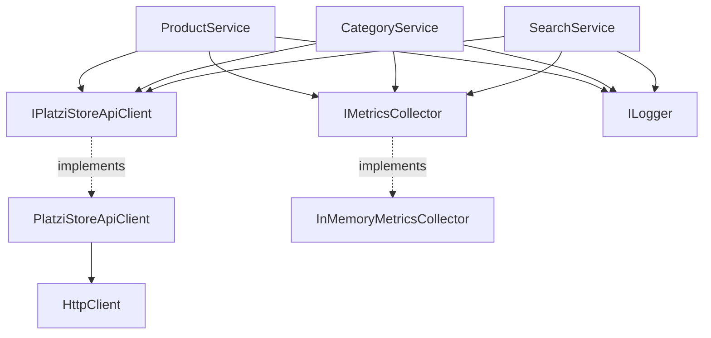

# Data Model: Core Services & Infrastructure

**Feature**: `2-core-services`  
**Date**: 2026-03-09

## New Entities (this phase)

### IPlatziStoreApiClient (Interface — Application Layer)

The abstraction for all external Platzi API communication. Defined in
Application to respect Dependency Inversion.

**Methods** (all async, returning domain entities directly):

| Method | Parameters | Returns | Description |
|--------|-----------|---------|-------------|
| `GetAllProductsAsync` | `int? offset, int? limit` | `IEnumerable<Product>` | List products with pagination |
| `GetProductByIdAsync` | `int id` | `Product` | Single product by ID |
| `GetProductBySlugAsync` | `string slug` | `Product` | Single product by slug |
| `CreateProductAsync` | `CreateProductDto dto` | `Product` | Create new product |
| `UpdateProductAsync` | `int id, UpdateProductDto dto` | `Product` | Update existing product |
| `DeleteProductAsync` | `int id` | `bool` | Delete product |
| `GetRelatedProductsByIdAsync` | `int id` | `IEnumerable<Product>` | Related products by ID |
| `GetRelatedProductsBySlugAsync` | `string slug` | `IEnumerable<Product>` | Related products by slug |
| `GetAllCategoriesAsync` | — | `IEnumerable<Category>` | List all categories |
| `GetCategoryByIdAsync` | `int id` | `Category` | Single category by ID |
| `GetCategoryBySlugAsync` | `string slug` | `Category` | Single category by slug |
| `CreateCategoryAsync` | `CreateCategoryDto dto` | `Category` | Create new category |
| `UpdateCategoryAsync` | `int id, UpdateCategoryDto dto` | `Category` | Update existing category |
| `DeleteCategoryAsync` | `int id` | `bool` | Delete category |
| `GetProductsByCategoryAsync` | `int categoryId` | `IEnumerable<Product>` | Products in category |
| `SearchProductsAsync` | `SearchProductsDto filters` | `IEnumerable<Product>` | Search with filters |

### IMetricsCollector (Interface — Infrastructure Layer)

| Method | Parameters | Returns |
|--------|-----------|---------|
| `RecordExecution` | `string toolName, long elapsedMs, bool success, string? errorType` | `void` |
| `GetMetrics` | `string toolName` | `ToolMetrics` |
| `GetAllMetrics` | — | `IReadOnlyDictionary<string, ToolMetrics>` |

### ToolMetrics (Data Model)

| Field | Type | Description |
|-------|------|-------------|
| `TotalCalls` | `int` | Total number of invocations |
| `SuccessCount` | `int` | Successful completions |
| `FailureCount` | `int` | Failed completions |
| `AverageExecutionTimeMs` | `double` | Running average of execution time |
| `TotalExecutionTimeMs` | `long` | Sum of all execution times (for avg calculation) |
| `ErrorsByType` | `Dictionary<string, int>` | Error count by classification |

**Thread Safety**: All mutable fields updated via `Interlocked` operations.

## Existing Entities (from Phase 1, unchanged)

- **Product** — `MCPDemo.Domain.Entities.Product`
- **Category** — `MCPDemo.Domain.Entities.Category`
- **PriceRange** — `MCPDemo.Domain.ValueObjects.PriceRange`
- **Result<T>** — `MCPDemo.Shared.Models.Result`
- **ErrorResponse** — `MCPDemo.Shared.Models.ErrorResponse`

## Relationships

## Validation Rules

### ProductService

| Field | Rule | Error Message |
|-------|------|---------------|
| `Title` (create) | Must not be null or whitespace | "Product title is required" |
| `Price` (create) | Must be >= 0 | "Product price must be non-negative" |
| `CategoryId` (create) | Must be > 0 | "Valid category ID is required" |
| `Images` (create) | Must not be null or empty | "At least one image URL is required" |
| Update DTO | At least one field must be non-null | "No fields to update" |

### CategoryService

| Field | Rule | Error Message |
|-------|------|---------------|
| `Name` (create) | Must not be null or whitespace | "Category name is required" |
| `Image` (create) | Must not be null or whitespace | "Category image URL is required" |
| Update DTO | At least one field must be non-null | "No fields to update" |
